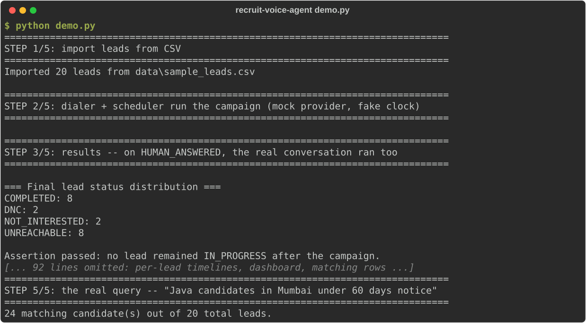

# recruit-voice-agent

Outbound recruitment voice agent. It cold-calls a candidate, runs a fixed
6-slot screening script (interested, years of experience, domain, city,
notice period, confirmation) through a deterministic LangGraph state
machine, and stores the structured result as queryable rows.

Built with zero paid services: Groq/Gemini free tiers for LLM extraction,
local faster-whisper + Piper for voice, SQLite for storage, and a mock
telephony provider with retry/backoff.

**No real call has ever been placed.** Phase 5 (real telephony) is
deliberately stubbed pending the compliance work in `docs/COMPLIANCE.md`.

- **`docs/RESULTS.md` is the honest numbers** — accuracy, fill rate, latency,
  escalation rate, and two incidents worth reading (a Whisper hallucination
  that would have hung up on a live candidate, and a daily model quota that
  a single day of testing exhausted). Every figure there came from a real
  command, with the small-sample and unresolved ones labelled as such.
- **`docs/COMPLIANCE.md`** is what's legally required before any real call.



<sub>Real output of `python demo.py` (scripted fake LLM, mock telephony, no keys), with the middle ~80 lines of per-lead detail marked as omitted. Regenerate with `python scripts/make_readme_capture.py`.</sub>

## Quickstart (no API key needed)

```
python -m venv .venv && .venv\Scripts\activate      # Windows; source .venv/bin/activate elsewhere
pip install -r requirements.txt
python demo.py
```

`demo.py` is the whole pipeline in one script against a scripted fake LLM —
no network, no key: CSV lead import → dialer with retry/backoff → the real
conversation state machine on answered calls → a dashboard listing → a real
SQL query ("Java candidates in Mumbai under 60 days notice"). Takes seconds.

`pytest -q` (240 tests) also runs cold, with no key and no model downloads.

## Setup for the parts that need more

Copy `env.example.txt` to `.env` and set `GROQ_API_KEY` (free tier:
https://console.groq.com/keys). Nothing in Phases 1–3 costs money.

> `llama-3.3-70b-versatile` (the model originally targeted) was decommissioned
> on Groq's free tier. Defaults are now `openai/gpt-oss-20b` (fast) escalating
> to `openai/gpt-oss-120b`. Re-check `client.models.list()` if these also go.

For the voice loop, one one-time local model download:

```
python -m piper.download_voices en_US-lessac-medium --download-dir models
```

faster-whisper fetches its own model on first use (default `small`,
multilingual — needed for Hinglish; `WHISPER_MODEL=base` for a smaller one).

## Commands

| Command | What it does | Needs a key? |
|---|---|---|
| `python demo.py` | Full pipeline end to end, fake LLM | no |
| `pytest -q` | 240 tests | no |
| `python -m src.cli` | Text conversation; type replies at `YOU:` | yes |
| `python -m src.api.main` | Voice server + dashboard on :8000 | yes |
| `python -m src.dialer.import_csv leads.csv` | Import `phone,name,dnc_flag` | no |
| `python -m src.dialer.demo` | 20-lead deterministic retry demo | no |
| `python -m src.sim.run_sim` | 8 personas through the real extractor | yes |
| `python -m src.sim.eval_report` | Accuracy + held-out + latency (~250 calls) | yes |
| `python -m src.sim.escalation_rate` | How often the 120b tier would be used | yes |
| `python -m src.sim.latency_diagnosis [fast\|escalation\|dual]` | Latency histogram + retry rate | yes |

For the voice loop: run the server, open http://localhost:8000, click
**Start Call**, grant mic access, and talk. The page shows replies and
per-turn STT/LLM/TTS latency. Speaking over the agent cuts its audio;
~7s of silence gets an "are you still there?", ~12s ends the call.

## How it works

**Conversation** (`src/agent/`) — a LangGraph state machine, one node per
slot, deterministic transitions. The LLM only ever *extracts* (utterance →
JSON slots + intent + confidence); it never decides what happens next.

**Extraction, in three tiers of cost:**
1. `extractor.py::_fast_path` — a deterministic pre-pass for short,
   unambiguous yes/no and number replies, Hinglish included ("haan", "ji",
   "nahi"). ~40% of real turns, **zero LLM calls**.
2. `gpt-oss-20b` at `reasoning_effort=low`, `temperature=0`.
3. `EscalatingLLMClient` → `gpt-oss-120b`, but only when the fast tier's own
   reported confidence is under 0.7. Measured escalation rate: 10.3% of real
   LLM turns. Whether that tier earns its keep is still open — `docs/RESULTS.md`.

`GeminiClient` and a local `OllamaClient` sit behind the same `LLMClient`
interface (`LLM_PROVIDER=gemini|ollama`). Neither is the default; the Ollama
spike was measured and rejected on CPU-only hardware, see `docs/RESULTS.md`.

**Domain is a canonical tag, not free text** — `slots.py::normalize_domain_tag`
maps free text onto a fixed 12-tag vocabulary via an alias table, keeping the
candidate's literal words in `candidate_profiles.domain_raw`. That's what
makes "Java candidates in Mumbai under 60 days" an exact-match SQL query
(`tests/test_candidate_query.py`, and STEP 5 of `demo.py`).

**Voice** (`src/voice/`) — faster-whisper STT, Piper TTS, webrtcvad
endpointing. The fixed lines (disclosure, all 6 slot questions, the opening)
are pre-rendered at startup and cached by exact text, so only reprompts pay
live synthesis. Filler audio ("Got it.", "Mm-hmm.") plays the instant an
utterance ends, which doesn't reduce latency — it hides it, measurably:
~2984ms of perceived silence → ~0ms.

STT is hardened against a real failure this project hit: Whisper
hallucinating fluent text on short clips. `vad_filter=True`,
`condition_on_previous_text=False`, `no_speech_threshold=0.6`, clips under
0.5s never reach the model at all, and — most importantly — HANGUP now
requires an explicit corroborating phrase in the words plus confidence ≥ 0.7,
so a hallucinated sign-off can no longer end a call. Full incident:
`docs/RESULTS.md`.

**Barge-in** requires `BARGE_IN_MIN_SPEECH_MS` (default 120ms) of
*consecutive* speech before cancelling the agent — a single 20ms frame of
line noise, or the agent's own audio echoing back, must not cut it off. The
audio that triggered the barge-in is kept, not discarded, so the candidate's
first word isn't clipped.

**Dialer** (`src/dialer/`) — `TelephonyProvider` ABC + `CallOutcome` enum,
with `MockProvider` the only implementation until Phase 5.
`scheduler.py` holds the retry backoff (+15min, +2h,
next-day-different-bucket, give up after 4), the 09:00–21:00 IST
calling-hours gate, and `DialerEngine`. `RecruitScheduler` wraps APScheduler
with a SQLAlchemy jobstore in the same SQLite file, so retries survive a
process restart.

On `HUMAN_ANSWERED` the engine runs the real conversation graph, and the
conversation's outcome becomes the lead's final status — a lead is never
left at IN_PROGRESS once a campaign resolves it. If the process dies
mid-call, a startup sweep resets anything IN_PROGRESS for over 10 minutes
back to QUEUED.

`status=UNREACHABLE` is a rollup; `leads.terminal_reason` records which
outcome caused it. `FAILED` is treated as infra error, not a lead problem:
its own 5-minute backoff, capped at 3 consecutive, and it does **not** count
against `leads.attempts`.

**Storage** — `leads`, `call_attempts`, `conversations`,
`candidate_profiles`. All datetime columns go through
`models.UTCDateTime`, which stores UTC and returns UTC-aware values;
SQLite's plain `DateTime` silently drops the offset, and a naive value read
back would be localized as IST by APScheduler and fire every retry 5h30m
late.

## Security

A prototype, not hardened for public exposure. `/dashboard` and `/ws/call`
are **unauthenticated by default** — fine for local-only use, since the
server binds `127.0.0.1`. To go beyond localhost:

1. Set `RECRUIT_AGENT_API_KEY` in `.env`. It's enforced on `/dashboard`
   (`X-API-Key` header) and `/ws/call` (`?api_key=...` query param —
   browsers can't set custom headers on a WebSocket handshake).
2. Run `python -m src.api.main`, **not** a bare `uvicorn ...`. It binds
   exactly `BIND_HOST`/`BIND_PORT`, which is what the startup check trusts:
   if `BIND_HOST` is non-local and no key is set, **the app refuses to
   start** rather than serving every lead's PII to whoever finds the port.
   A bare `uvicorn --host 0.0.0.0` bypasses that check, since the app can't
   see uvicorn's CLI flags.
3. `/ws/call` is rate-limited independently of auth (`MAX_CONCURRENT_CALLS`,
   `MAX_CALLS_PER_IP_PER_MINUTE`) — a valid key doesn't stop a buggy client
   from draining the LLM quota or pegging the CPU on faster-whisper.
4. Per-utterance audio is capped at 15 seconds, and logs a warning if that
   ever fires — no real slot answer runs that long.
5. Candidate phone numbers are masked in logs (`config.mask_phone`).

None of this replaces a real reverse proxy and auth layer if this is ever
internet-facing.

## Phase 5 — real telephony (stubs only, gated)

`src/dialer/exotel.py` and `src/dialer/plivo.py` implement
`TelephonyProvider`, but `place_call` only raises `NotImplementedError` — no
credentials, no network calls. Each documents the real API shape (endpoints,
auth, how live audio would reach `CallSession`, how outcomes map to
`CallOutcome`) for whenever it's wired up.

**Do not wire up real credentials before reading `docs/COMPLIANCE.md`** —
DLT registration, NCPR/DND scrubbing, TCCCPR calling hours and consent,
mandatory AI disclosure, recording consent, and PII retention, with an
explicit open-questions list needing legal sign-off. It was written from
secondary sources plus one primary regulation PDF that turned out to be a
scanned image and couldn't be machine-verified: it's a briefing document,
not legal advice.

## Development

```
pytest -q          # 240 tests, no key, no network
ruff check .       # lint (config in pyproject.toml)
python demo.py     # end-to-end smoke
```

CI runs all three on every push (`.github/workflows/ci.yml`).

There's a `Dockerfile` for the API/dialer side. It deliberately excludes the
voice loop, which needs a microphone and the 63MB Piper model — run that on
the host.

## Status

Phases 1–4 built and eval-hardened. Phase 5 is stubs plus the compliance
document. Known-open items are listed at the end of `docs/RESULTS.md`; the
two biggest are the real gpt-oss-120b vs. fast-tier delta (blocked on the
daily quota) and whether the provider-side latency variance changes by time
of day.
